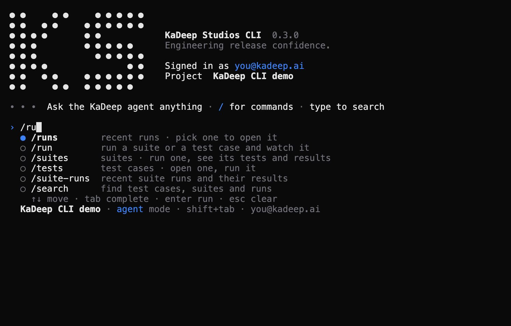
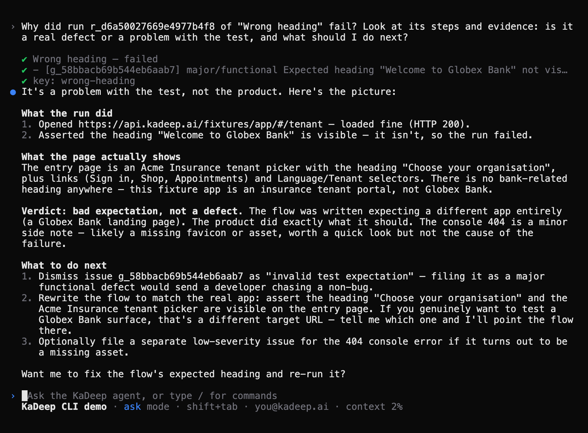
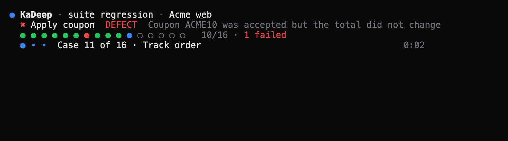
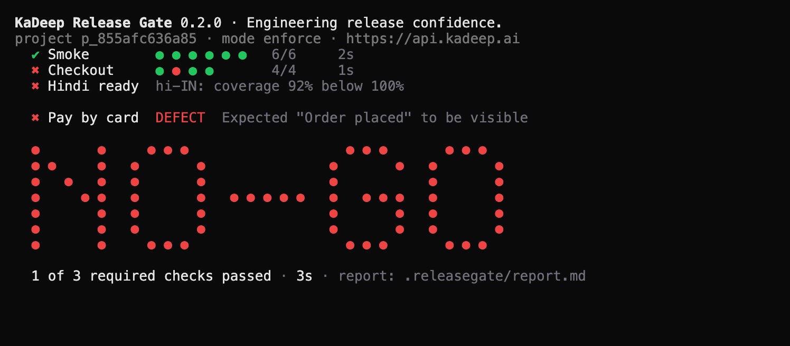
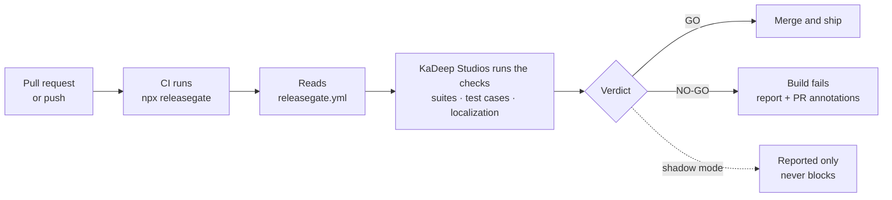
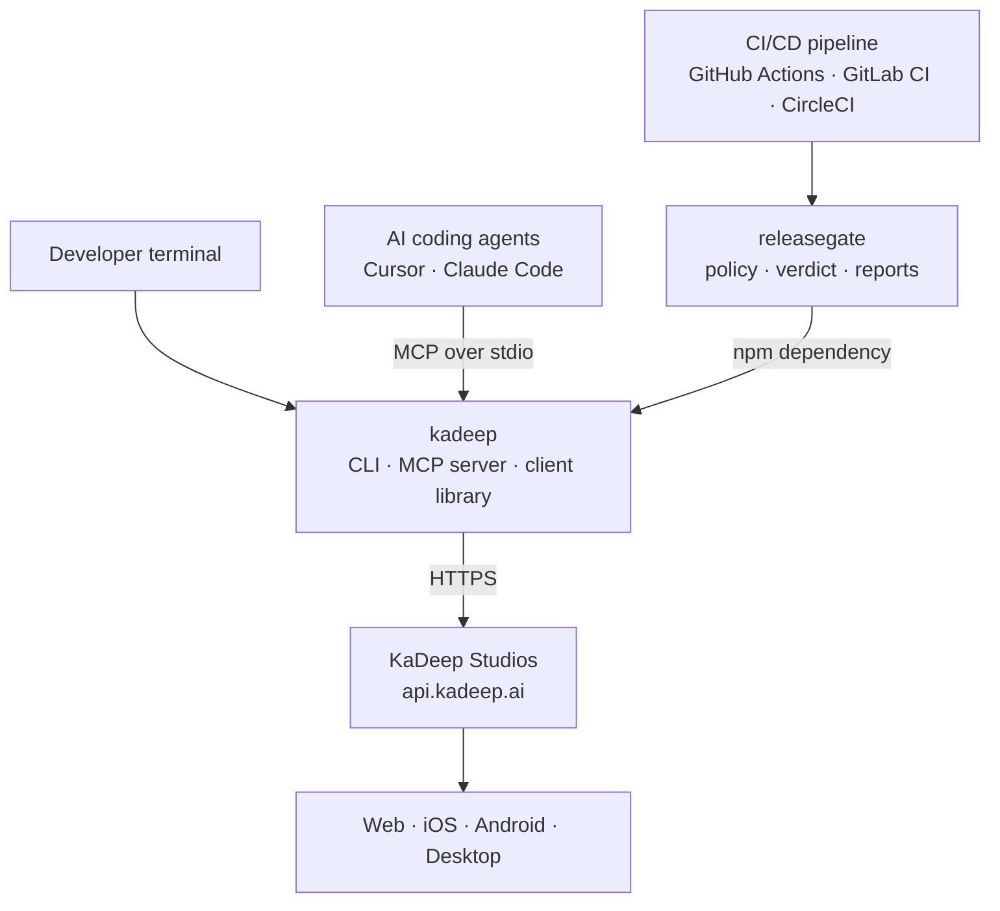
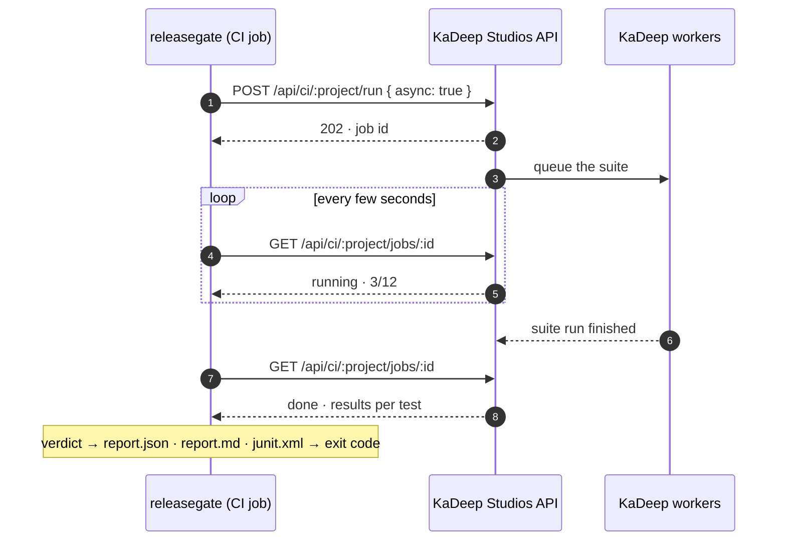

<p align="center">
  <a href="https://kadeep.ai"></a>
</p>

<h1 align="center">KaDeep CLI</h1>

<p align="center">
  <b>AI end-to-end testing from your terminal, your CI/CD pipeline and your coding agents.</b><br>
  Run KaDeep Studios tests on web, mobile and desktop, and get a go / no-go for every release.
</p>

<p align="center"><i>Know exactly when to ship. Engineering release confidence.</i></p>

<p align="center">
  <a href="https://www.npmjs.com/package/kadeep"></a>
  <a href="https://www.npmjs.com/package/releasegate"></a>
  <a href="https://github.com/kadeep-ai/kadeep-cli/actions/workflows/ci.yml"></a>
  
  
  <a href="LICENSE"></a>
</p>

<p align="center">
  <a href="https://kadeep.ai/start"><b>Get started for free</b></a> ·
  <a href="https://kadeep.ai/get-started">Book a walkthrough</a> ·
  <a href="packages/kadeep#readme">kadeep docs</a> ·
  <a href="packages/releasegate#readme">releasegate docs</a>
</p>

---

**KaDeep Studios** is an autonomous release-readiness QA agent. You give it your product and the user journeys that make revenue, and it runs them on web, mobile and desktop. What comes back is a **go or no-go, not a test report**.

**KaDeep CLI** brings KaDeep Studios to the command line, as two open-source npm packages:

| Package | Command | What it does |
| --- | --- | --- |
| [`kadeep`](packages/kadeep#readme) | `kadeep` | The KaDeep Studios command line and MCP server. Type `kadeep` for an interactive home: talk to the KaDeep agent, `/` for commands, search, open any run without copying an id. Browse projects, suites and test cases; run them and read results; gate localization; set up a repository; and let Cursor, Claude Code and other AI coding agents use KaDeep as tools. `--json` on every command. |
| [`releasegate`](packages/releasegate#readme) | `releasegate` | **KaDeep Release Gate**, a go / no-go quality gate for CI/CD. It reads `releasegate.yml`, runs the KaDeep Studios checks the policy requires for the current commit, writes a report and passes or fails the build. It has a non-blocking shadow mode for first-time setup. |

## Contents

- [Quick start](#quick-start)
- [What it looks like](#what-it-looks-like)
- [Features](#features)
- [From commit to go / no-go](#from-commit-to-go--no-go)
- [How it works](#how-it-works)
- [Use cases](#use-cases)
- [Which package do I need?](#which-package-do-i-need)
- [Terminology](#terminology)
- [FAQ](#faq)
- [Development](#development)

## Quick start

You need **Node.js 20+** and a KaDeep Studios account ([get started for free](https://kadeep.ai/start)).

```sh
npx kadeep                       # the interactive home: sign in, pick a project, then ask the agent or type /
npx kadeep run --suite smoke     # or one command at a time: run a suite and wait for the verdict
npx kadeep init                  # add a releasegate policy + GitHub Actions workflow to this repo
```

After `kadeep init`, every pull request runs `npx releasegate` and gets a go / no-go:

```
KaDeep Release Gate 0.3.0 · Engineering release confidence.
project p_9a118f0499704752be72 · commit 8c3f2d1 on feature/checkout PR #214 · mode enforce
▸ Smoke
✓ Smoke: 12/12 passed (2m 41s)
▸ Checkout
✗ Checkout: 3/4 passed (1m 05s)
    ✗ Pay by card [DEFECT] · Expected "Order placed" to be visible

NO-GO · 1/2 required checks passed · 3m 47s
```

## What it looks like

A terminal UI built on the dot, like the KaDeep Studios logo: every test is a dot, and the release verdict is drawn in dots. It has no dependencies, and output stays plain in CI.

<table>
  <tr>
    <td></td>
    <td></td>
  </tr>
  <tr>
    <td></td>
    <td></td>
  </tr>
</table>

## Features

| You want to… | Command |
| --- | --- |
| Drive everything from one place in the terminal, like Claude Code | `kadeep` (the interactive home) |
| Ask the KaDeep agent why something failed, or have it act | Type the question in the home, or `kadeep ask "…"` |
| Run AI end-to-end tests from the terminal | `kadeep run --suite smoke` |
| Run specific test cases on another browser or screen size | `kadeep run --test checkout-works --browser firefox --viewport mobile` |
| See why a test failed, step by step | `/runs` in the home, then pick the run · `kadeep runs show <runId>` |
| Browse projects, suites, test cases and defects | `kadeep projects` · `kadeep suites` · `kadeep tests` · `kadeep issues` |
| Block a release when required checks fail | `npx releasegate` in CI |
| Try the gate first without blocking anyone | `mode: shadow` in `releasegate.yml` |
| Set up a repository (policy, CI workflow, agent config) in one step | `kadeep init` |
| Let Cursor or Claude Code run and read your tests | `kadeep mcp` (MCP server) |
| Check localization quality in CI | `kadeep loc validate` · a `localization` check in `releasegate.yml` |
| Script anything, parse the output | `--json` on every command, stable exit codes |
| Publish test results to CI dashboards | `kadeep run --junit results.xml` · `releasegate` writes `junit.xml` |
| Watch runs live in the terminal, plain in CI | Rich view in a terminal; `NO_COLOR`, `KADEEP_UI=plain` |

## From commit to go / no-go



- **GO**: every required check passed.
- **NO-GO**: a required check failed or errored. An empty suite is never a pass.
- **Shadow mode**: the verdict is reported but never fails the build, so you can watch the gate for a while before letting it block.

The report lands in `.releasegate/` (`report.json`, `report.md`, `junit.xml`). On GitHub it also goes into the job summary and annotates failing checks.

## How it works



- **`kadeep` is the foundation.** It contains the CLI, the MCP server and the client library: sign-in, runs, localization and CI detection. It has no runtime dependencies.
- **`releasegate` is built on `kadeep`.** It adds the policy file, the go / no-go decision, shadow mode and the reports. It depends on `kadeep`, never the reverse.
- **Only HTTPS calls to the KaDeep Studios API.** Tests run in KaDeep Studios, on the model key your team configured there. The CLI itself never calls an AI model and collects no telemetry.

Runs are **jobs on KaDeep's queue**. The CLI starts them and polls, so no request stays open while a suite runs. A long suite survives proxies with idle timeouts, and a CI network blip costs one retried poll:



## Use cases

### Run end-to-end tests from the terminal

```sh
kadeep use "Acme web"                        # default project
kadeep run --suite smoke                     # ✓ / ✗ per test, exit 1 if any fail
kadeep runs show r_bf6382d90aab              # every step, the verdict and why
kadeep run --suite regression --no-wait      # queue it, come back later
kadeep jobs show job_8ad6a6bb92 --wait
```

### Add a release gate to GitHub Actions

`kadeep init` generates `.github/workflows/releasegate.yml`. Its core:

```yaml
name: KaDeep Release Gate
on:
  pull_request:
  push:
    branches: [main]
jobs:
  releasegate:
    runs-on: ubuntu-latest
    steps:
      - uses: actions/checkout@v4
      - uses: actions/setup-node@v4
        with:
          node-version: 22
      - run: npx -y releasegate@^0.1
        env:
          KADEEP_CI_TOKEN: ${{ secrets.KADEEP_CI_TOKEN }}
```

The policy file sits next to it:

```yaml
# releasegate.yml
version: 1
project: p_9a118f0499704752be72
mode: shadow            # switch to enforce once you trust the verdicts
checks:
  - suite: smoke
  - tests: [checkout-works]
    viewport: mobile
  - localization:
      locales: [hi-IN, ar-AE]
```

GitLab CI, CircleCI, Bitbucket Pipelines, Buildkite, Azure Pipelines and Jenkins work the same way. See [releasegate: CI setup](packages/releasegate#ci-setup).

### Let AI coding agents run your QA (MCP)

```sh
claude mcp add kadeep -- npx -y kadeep mcp        # Claude Code
```

```json
{ "mcpServers": { "kadeep": { "command": "npx", "args": ["-y", "kadeep", "mcp"] } } }
```

That second snippet goes in Cursor's `.cursor/mcp.json`. Your agent can then answer "which smoke tests fail and why?" or "run the checkout tests" by itself. It gets 14 tools: projects, suites, test cases, runs, jobs, defects and the localization gate.

### Gate localization in CI

```sh
kadeep loc push --file locales/en.json --translate     # new source strings
kadeep loc validate --locale hi-IN --locale ar-AE      # exit 1 with the reasons
kadeep loc pull --asset en.json --locale hi-IN         # approved translations only
```

## Which package do I need?

| If you… | Use |
| --- | --- |
| work in a terminal or write scripts | `kadeep` |
| want Cursor, Claude Code or another MCP client to use KaDeep | `kadeep mcp` |
| want CI to pass or fail a build on KaDeep results, with a policy and reports | `releasegate` (it installs `kadeep` for you) |
| just want to run one suite in CI and fail on red | `kadeep run --project <id> --suite smoke` |

## Terminology

| Term | Meaning |
| --- | --- |
| **KaDeep Studios** | The QA platform and app where your projects, test cases and runs live |
| **KaDeep CLI** | This repository's command line, the `kadeep` package and command |
| **KaDeep Release Gate** | The CI gate, the `releasegate` package and command. Its policy file is `releasegate.yml` |
| **Test case** | One user journey KaDeep runs, e.g. *checkout works*. `kadeep tests` lists them; the API calls them *flows* |
| **Suite** | A named group of test cases, e.g. *smoke* |
| **Run** / **suite run** | One execution of a test case / of a suite, with a verdict and evidence |
| **Job** | A queued or running execution. The CLI follows jobs until they finish |
| **CI token** | A project's token for pipelines (`KADEEP_CI_TOKEN`), created with `kadeep ci-token create` |
| **GO / NO-GO** | The gate's verdict. **Shadow** mode reports it; **enforce** mode fails the build on NO-GO |

## FAQ

<details>
<summary><b>What is a release gate?</b></summary>

A release gate is an automated check in your CI/CD pipeline that decides whether a change may ship. `releasegate` makes that decision from KaDeep Studios results for the exact commit under test: suites, test cases and localization. It returns GO or NO-GO, with a report of why.
</details>

<details>
<summary><b>Is KaDeep CLI free and open source?</b></summary>

Yes. `kadeep` and `releasegate` are open source under Apache-2.0. They connect to KaDeep Studios, where your tests run, and you can [get started for free](https://kadeep.ai/start).
</details>

<details>
<summary><b>Which CI/CD systems does releasegate support?</b></summary>

Any pipeline that can run Node.js 20. The commit, branch, PR number and run link are read automatically on GitHub Actions, GitLab CI, CircleCI, Bitbucket Pipelines, Buildkite, Azure Pipelines and Jenkins. Anywhere else, the gate falls back to `git`.
</details>

<details>
<summary><b>Does it work with Cursor, Claude Code and other AI agents?</b></summary>

Yes. `kadeep mcp` is a Model Context Protocol server over stdio. Any MCP client can list your tests, run them, wait for the verdict and read failures step by step.
</details>

<details>
<summary><b>What does the CLI send, and where are credentials stored?</b></summary>

It only makes HTTPS calls to the KaDeep API you point it at (`https://api.kadeep.ai` by default), with no telemetry. Your session is stored in `~/.config/kadeep/config.json`, readable only by you. In CI, a per-project CI token is used instead of a personal login.
</details>

<details>
<summary><b>Can I try the gate without blocking my team?</b></summary>

Yes. Set `mode: shadow` in `releasegate.yml` (`kadeep init` starts there). The gate runs every check, writes the report and says "would have blocked", but always exits 0. Switch to `mode: enforce` when its verdicts match your judgement.
</details>

## Development

```sh
git clone https://github.com/kadeep-ai/kadeep-cli.git && cd kadeep-cli
npm install
npm run ci            # typecheck (JSDoc + checkJs), tests on the local Node, tarball check
```

```
packages/
  kadeep/         CLI, MCP server and client library (no runtime dependencies)
  releasegate/    KaDeep Release Gate (depends on kadeep and yaml)
scripts/
  check-packs.mjs guards what npm publishes
```

- **Sources:** plain ES modules with JSDoc types. There is no build step, so what is in `packages/*/src` is what ships.
- **CI:** runs the tests on Node.js 20, 22 and 24.
- **Tarball check:** `scripts/check-packs.mjs` fails a publish if anything other than `bin/`, `src/`, `README.md` and `LICENSE` would ship, or if a file contains a secret or a source map.
- **Releases:** both packages share one version. Publish `kadeep` first, then `releasegate`.

Found a bug or have an idea? [Open an issue](https://github.com/kadeep-ai/kadeep-cli/issues).

## License

[Apache-2.0](LICENSE) © Kadeep Technologies. KaDeep Studios is a product of Kadeep Technologies ([kadeep.ai](https://kadeep.ai)).
